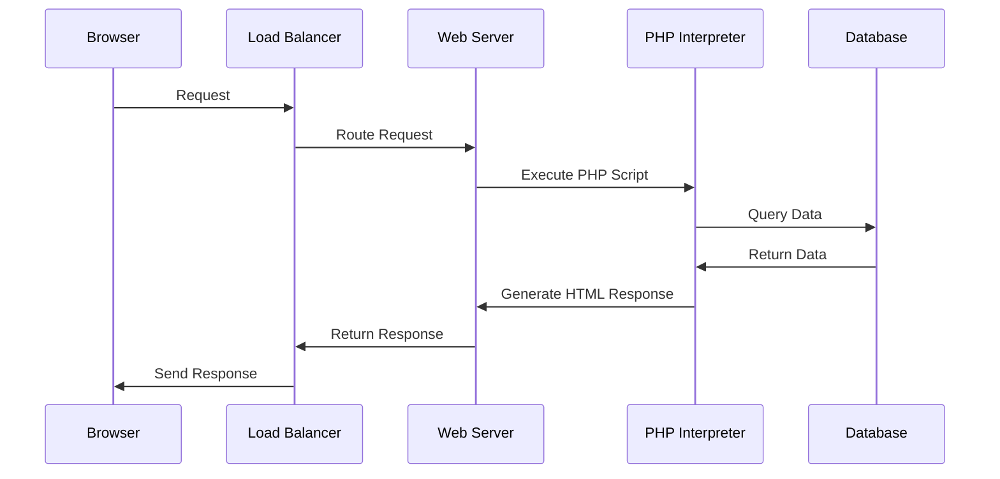
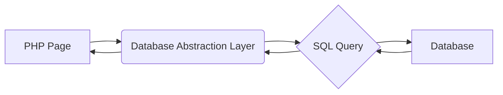
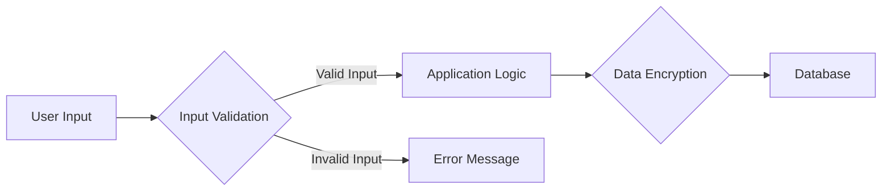

# System Design

## System Architecture

This section provides an overview of the system's architecture.

## PHP to Database Interaction

PHP pages connect to the database using a database abstraction layer (e.g., PDO). This layer allows PHP code to execute SQL queries and retrieve data. Prepared statements are used to prevent SQL injection attacks.

## Encryption and Security

-   **Data Encryption:** Sensitive data (e.g., passwords) are encrypted using strong encryption algorithms (e.g., bcrypt).
-   **HTTPS:** All communication between the client and server is encrypted using HTTPS.
-   **Input Validation:** All user input is validated to prevent cross-site scripting (XSS) and other injection attacks.
-   **Prepared Statements:** Prepared statements are used to prevent SQL injection attacks.
-   **Regular Security Audits**: The application is regularly audited for security vulnerabilities.

