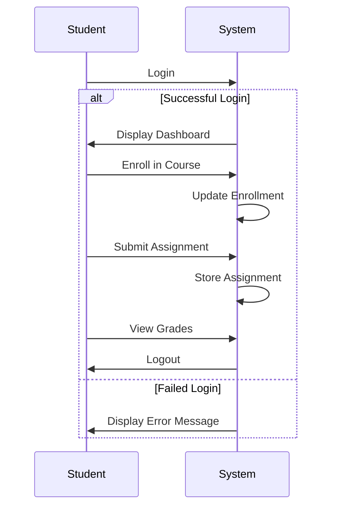
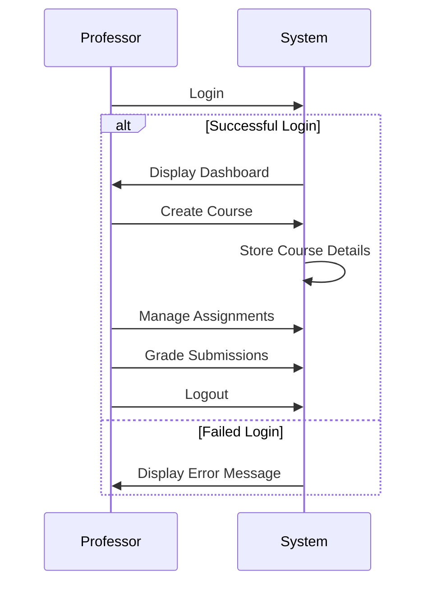
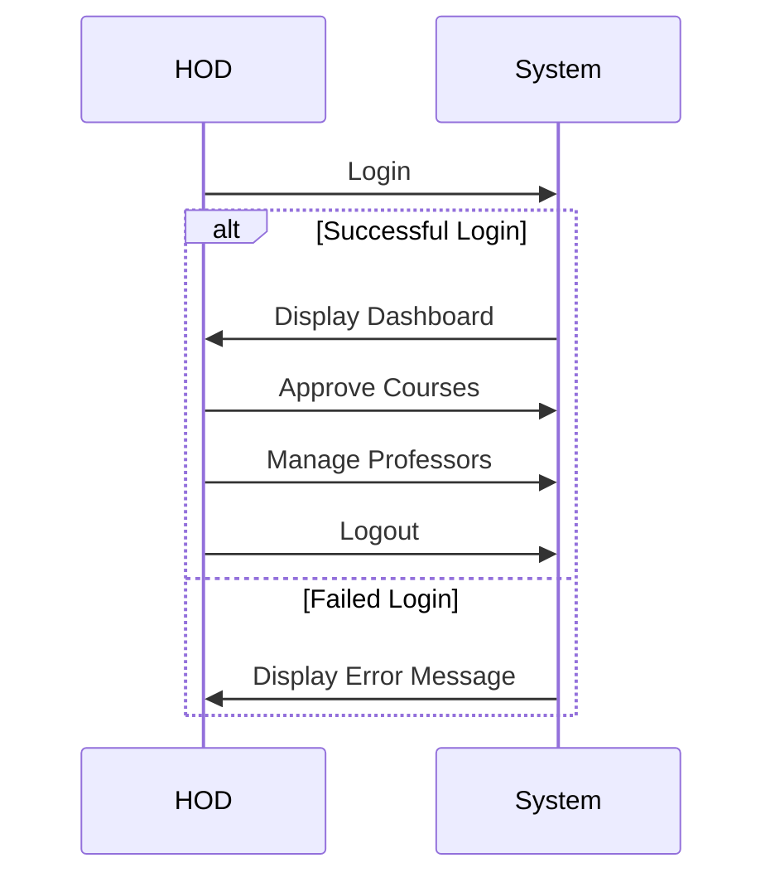
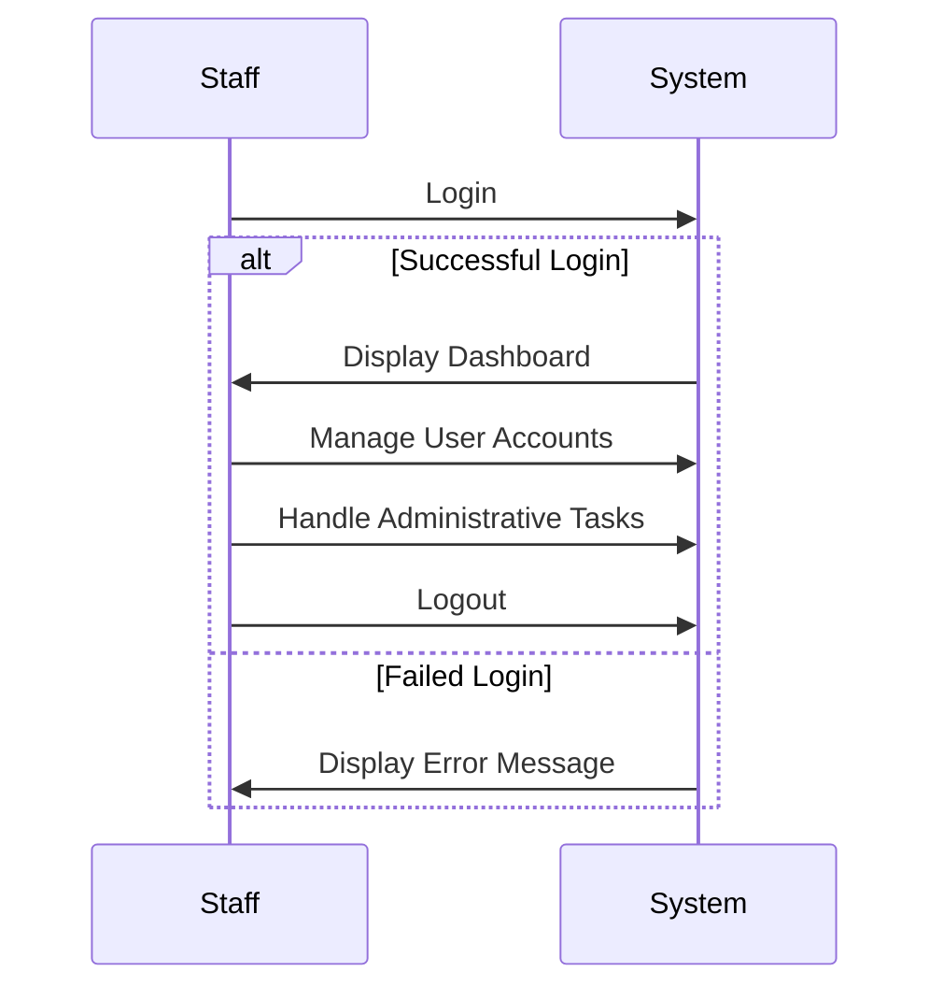

# Workflow

This document outlines the workflows for different user roles within the system.

## User Roles

-   **Student:** Enrolls in courses, submits assignments, views grades.
-   **Professor:** Creates courses, manages assignments, grades submissions.
-   **HOD (Head of Department):** Approves courses, manages professors, oversees departmental activities.
-   **Staff:** Manages user accounts, handles administrative tasks.

## User Flows

### Student

### Professor

### HOD

### Staff

## Step-by-Step Process

### Login

1.  User enters username and password.
2.  System authenticates the user against the database.
3.  If authentication is successful, the system retrieves the user's role and displays the appropriate dashboard.
4.  If authentication fails, the system displays an error message.

### Registration

1.  User clicks on the "Register" link.
2.  System displays the registration form.
3.  User fills out the registration form with their details.
4.  System validates the user input.
5.  If the input is valid, the system creates a new user account in the database.
6.  System sends a verification email to the user's email address.

### Verification

1.  User clicks on the verification link in the email.
2.  System verifies the user's email address.
3.  System activates the user's account.
4.  User can now log in to the system.
